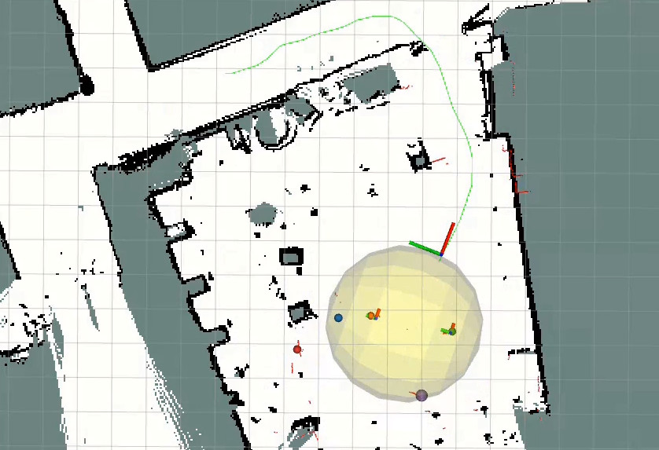

# 2d_lidar_people_tracker


## Install
```
mkdir -p $HOME/ros2_ws/src && cd $HOME/ros2_ws/src
git clone https://github.com/morpheus1820/2d_lidar_people_tracker
pip3 install torch torchvision
pip3 install -r 2d_lidar_people_tracker/requirements.txt
cd $HOME/ros2_ws 
colcon build && source install/setup.bash
```
## Docker
Build the docker image: `cd docker && ./build_docker.sh GIT_USERNAME GIT_USER_EMAIL GIT_TOKEN`

Run the image: `docker/run.sh`

## Configure
Laser: `detector_ros/config/dr_spaam_ros.yaml`
  - use_gpu: enable CUDA, default True
  - detector_model: DROW3 or DR-SPAAM, default DR-SPAAM
  - weight_file: model weights, for DR-SPAAM, default "ckpt_jrdb_ann_dr_spaam_e20.pth"

Camera:  `detector_ros/config/yolo.yaml`
  - fov: horizontal field of view, default 74
  - img_width: default 640

## Run

`ros2 launch crowd_management_ros pipeline.launch.py` (start full group detection)

OR

- Detectors:

`ros2 launch detector_ros dr_spaam_ros.launch.py` (laser only)

`ros2 launch detector_ros dr_spaam_ros_local.launch.py` (laser only (CPU) to be launched on r1-base)

`ros2 launch detector_ros dr_spaam_ros_remote.launch.py` (laser only (GPU) to be launched on remote laptop)

`ros2 launch detector_ros yolo.launch.py` (camera only)

`ros2 launch detector_ros both.launch.py` (laser + camera)

- Tracker:

`ros2 launch tracker_ros tracker_ros.launch.py` (must be launched *before* Yarp publishes the map)

- Crowd detector:

`ros2 launch crowd_management_ros detect_following.launch.py` (group detection only)

`ros2 launch crowd_management_ros crowd_management.launch.py` (group detection + turning around)

- Visualization:

`rviz2 -d detector_ros/config/r1-viz.rviz`

## Acknowledgements
This repository is based on https://github.com/VisualComputingInstitute/2D_lidar_person_detection
and the following publications:
```BibTeX
@article{Jia2021Person2DRange,
  title        = {{Self-Supervised Person Detection in 2D Range Data using a
                   Calibrated Camera}},
  author       = {Dan Jia and Mats Steinweg and Alexander Hermans and Bastian Leibe},
  booktitle    = {International Conference on Robotics and Automation (ICRA)},
  year         = {2021}
}

@inproceedings{Jia2020DRSPAAM,
  title        = {{DR-SPAAM: A Spatial-Attention and Auto-regressive
                   Model for Person Detection in 2D Range Data}},
  author       = {Dan Jia and Alexander Hermans and Bastian Leibe},
  booktitle    = {International Conference on Intelligent Robots and Systems (IROS)},
  year         = {2020}
}
```
We thank the authors for their contributions. 
